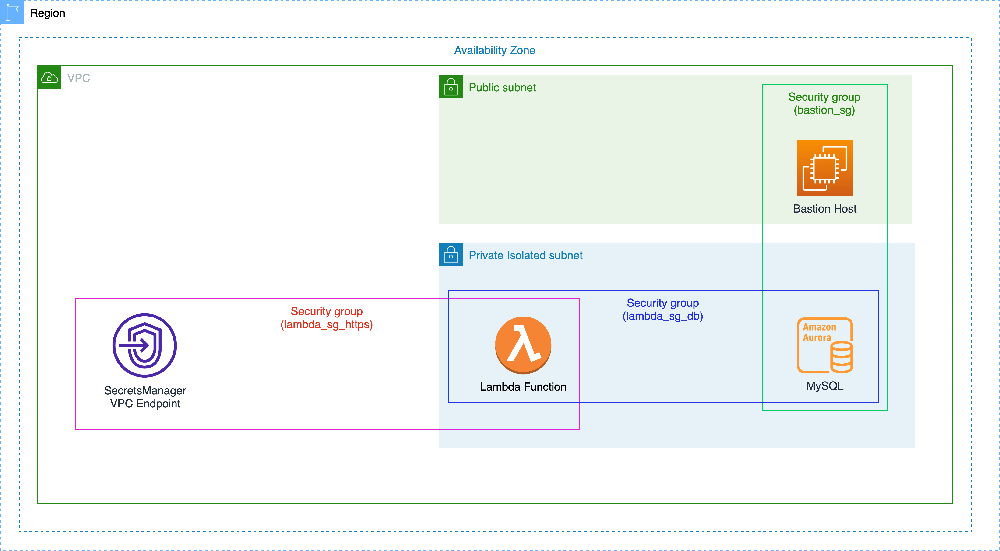

# Secret rotation for AWS SecretsManager with AL2023 and python v3.12

This code demonstrates enabling automatic rotation of secrets managed by AWS SecretsManager with a self-managed lambda function with Amazon Linux (AL) 2023 and python v3.12 runtime.

As per writing of this code and the accompanying blog post, AWS SecretsManager's provisioned lambda doesn't natively support python v3.12 runtime with AL2023. Currently supported version is python v3.9 with Amazon Linux 2.

As Amazon Linux 2 and python v3,9 are nearing their end of extended support, it is worth cosidering future proofing your deployments.

## Demo App Architecture

This is an AWS CDK app that creates a single AWS CloudFormation stack. It contains:

1. An AWS Aurora MySQL databse.
2. An EC2 instance actings as a bastion host to create database users.
3. An AWS Lambda function that controls rotation of secrets for the database users.



## Code for secret rotation

This code executes the logic that rotates a secret stored in Secrets Manager. This piece of code is specifically targeting secrets stored for MySQL database users and it is deployed as a lambda function.

Create a python 3.12 virtual environment and install the dependencies for the lambda function.

```sh
$ pyenv shell 3.12.4 #sets the shell python to v3.12.4
$ pyenv virtualenvwrapper #initializes virtualenvwrapper with shell's current python version
$ mkvirtualenv lambda #creates a new virtual env
$ pip install -r lambda/requirements.txt
```

To create the zip package, head to the `site-packages` of your python virtual environment, e.g.,

```sh
$ cd ~/.virtualenvs/lambda/lib/python3.12/site-packages
```

Create a zip file of your currently installed packages. Store the zip file alongwith your code, e.g.,

```sh
$ zip -r9 ~/SecretsRotationDemo/lambda/function.zip .
```

Add code to the zipped package, e.g.,

```sh
$ cd ~/SecretsRotationDemo/lambda
$ zip -g function.zip lambda_function.py
```

## Code for the demo stack

The code used to roll out the demo stack is found in `./secrets_rotation_demo/secrets_rotation_demo_stack.py`. Before synthesizing the stack, please update the environment variables found in `.env` file.

`DATABASE_USER` is a string denoting a MySQL database users for whom a secret credential will be created in SecretsManager. This credential will be rotated by the code in `./lambda/lambda_function.py`.

`REGION` is the AWS region in your account where you want to deploy your stack.

`KEY_PAIR_NAME` is the name of an EC2 Keypair that is going to be used to access the bastion host over SSH. Make sure that the keypair exists before deploying the stack. You can create a new keypair using AWS CLI, e.g.,

```sh
aws ec2 create-key-pair --key-name Ohio --query 'KeyMaterial' --output text > Ohio.pem
```

## Deploy the stack

Install requirements.

```sh
$ pip install -r requirements.txt

```

Deploy stack.

```sh
$ cdk synth
```
